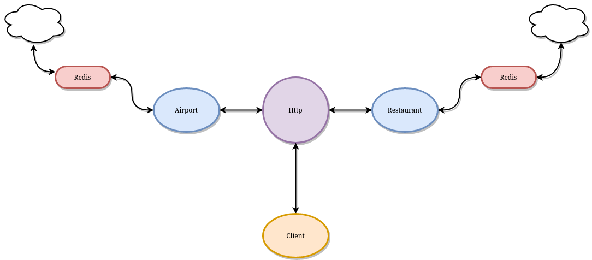

# Skylunch

The $100 hamburger is a general aviation tradition of flying to a neighboring airport for lunch. The meal is not what is important, it's only an excuse to fly. But that doesn't mean that you should have to settle for a mediocre meal.

`Skylunch` is a simple, non-blocking api built using [Spring Webflux](https://docs.spring.io/spring-framework/docs/current/reference/html/web-reactive.html) that, provided with an airport code, will return a list of restaurants with their ratings and other details.

The purpose of `Skylunch` is to help aviators find new and interesting destinations to elevate the enjoyment of their favorite hobby.

## How it works

### Technologies

`Skylunch` is built using the following technologies:
    - [Kotlin](https://github.com/JetBrains/kotlin)
    - [Spring Webflux](https://docs.spring.io/spring-framework/docs/current/reference/html/web-reactive.html)
    - [Redis OM Spring](https://github.com/redis/redis-om-spring)

### Data Storage and Access



Data is stored with Redis using [Redis OM Spring](https://github.com/redis/redis-om-spring).

Upon receiving a request, `Skylunch` will search the Redis cache/db for a result before querying the external api. External api calls will then be cached in Redis for subsequent requests.

Local results will also be checked for 'staleness' according to the configuration properties. Results that are older than the threshold age will be re-queried by external api.

### Note About Blocking Calls in Redis OM Java

As of version `0.5.1`, a fully non-blocking application is not possible using the Redis OM. This is because Redis OM uses the [Jedis](https://github.com/redis/jedis) library instead of the non-blocking [Lettuce](https://github.com/lettuce-io/lettuce-core) library to access Redis. Therefore, calls to the repository will be blocking.

## Deployment

### Docker Compose

For simple deployments a `docker-compose.yml` is provided in the repo. Just edit `start.sh` with your appropriate api keys.

```bash
./start.sh
```

## More Information about Redis Stack
1. [Developer Hub](https://redis.info/devhub) - The main developer page for Redis, where you can find information on building using Redis with sample projects, guides, and tutorials.
